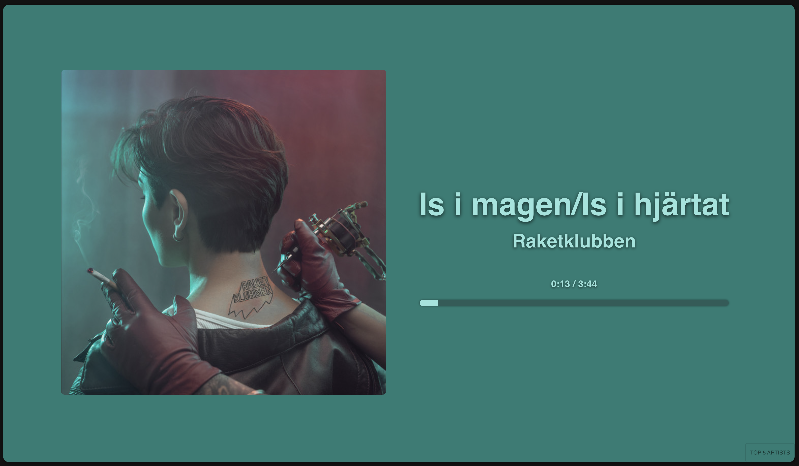
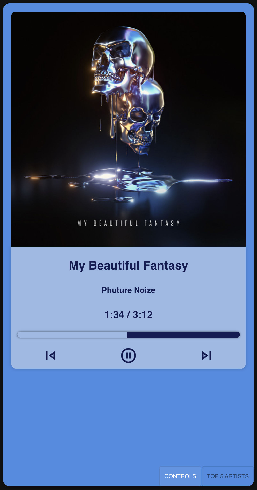
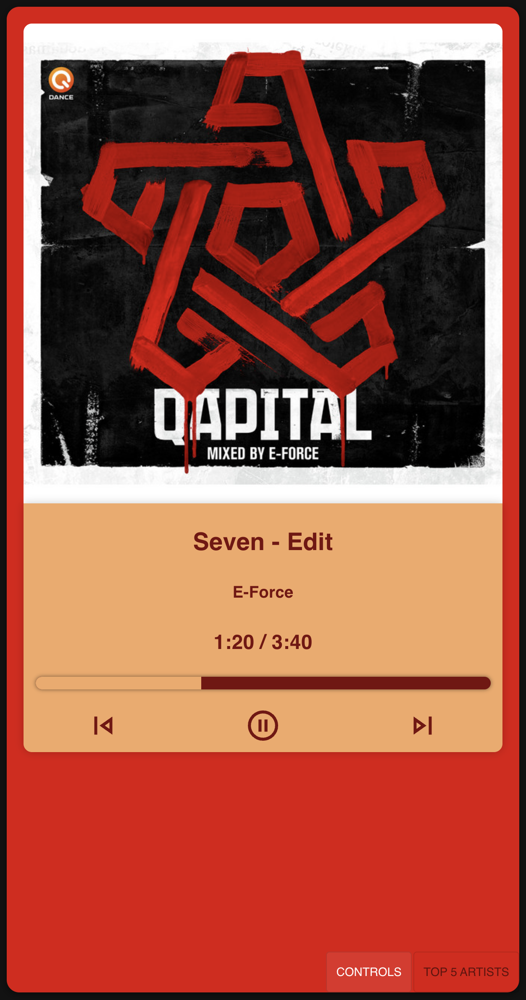

# Reactify

A React + TypeScript app that shows your currently playing Spotify track with a color‑adaptive UI based on the album art. It uses Spotify OAuth (PKCE), refresh tokens, and adaptive polling to keep the UI up to date.

The app is frontend-only and talks directly to the Spotify Web API from the browser.


## Features
- Spotify PKCE login with refresh token handling.
- Currently playing track UI with album art and color‑extracted theming.
- Controls for play/pause and skip to next/previous track.
- Progress bar with time remaining.
- Adaptive polling cadence (fast when playing, slower when paused/idle).
- MUI theming and a custom “vibrant” palette via `node-vibrant`.



## Tech Stack
- React 18 + TypeScript
- Material UI
- `node-vibrant` for color extraction


<p>
  
  
</p>


## Getting Started

### Prerequisites
- Node.js 18+ recommended
- A Spotify Developer app with a Redirect URI

### Spotify App Setup
Before you can run the project, you need to create a Spotify app:

1. Go to the Spotify Developer Dashboard.
2. Create an app.
3. Copy the app's Client ID.
4. Add this Redirect URI if you run the project locally with the default setup:

```text
http://localhost:8080/
```

Important:
- The Redirect URI in the Spotify dashboard must match exactly.
- The trailing slash matters.

### Environment Variables
Create a `.env` file in the project root with:

```bash
REACT_APP_CLIENT_ID=your_spotify_client_id
REACT_APP_REDIRECT_URI=http://localhost:8080/
REACT_APP_SCOPES=user-read-currently-playing user-read-playback-state user-top-read
```

Notes:
- `REACT_APP_REDIRECT_URI` defaults to the current origin if omitted.
- `REACT_APP_SCOPES` defaults to the scopes shown above if omitted.
- `REACT_APP_CLIENT_ID` is required.

### Install and Run

```bash
npm install
npm start
```

The app runs on `http://localhost:8080/`.

### First Run
When you open the app for the first time:

1. You are redirected to Spotify login.
2. You approve the requested permissions.
3. Spotify redirects you back to the app.
4. The app exchanges the code for access and refresh tokens.
5. Playback data is loaded and the UI starts polling for updates.

If nothing is currently playing on your Spotify account, the UI will stay idle until playback starts.

## How It Works (High Level)
- On first load, the app redirects to Spotify’s authorization endpoint using PKCE.
- Tokens are stored in `localStorage` with a short expiry buffer.
- The app refreshes access tokens automatically and retries requests once if needed.
- Polling cadence adapts to playback state.
- Album art colors are extracted and used to style the UI.

### Main Flow In The Code
- `src/api/pkce.ts` creates the PKCE verifier and challenge.
- `src/api/spotifyApi.ts` handles login, token exchange, token refresh, and Spotify API calls.
- `src/api/apiClient.ts` stores tokens and wraps authenticated Spotify requests.
- `src/components/MainPage.tsx` bootstraps the app and runs the polling loop.
- `src/components/CurrentSong.tsx` renders the main playback UI.

## Project Structure

```text
src/
  api/              Spotify auth, token handling, and API helpers
  components/       Main UI components
  contexts/         Shared React context for color extraction
  styling/          CSS styling
  types/            TypeScript types for Spotify data
```


## Scripts
- `npm start` — run the dev server on port 8080
- `npm build` — build for production
- `npm test` — run tests
- `npm run lint` — lint the project

## Troubleshooting
- If login loops or refresh fails, clear site data and re‑authorize to get a new refresh token.
- Ensure your Spotify app has the exact Redirect URI configured in the Spotify dashboard.
- Make sure you are logged into the same Spotify account that is currently playing music.
- If playback disappears briefly between songs, that can happen because Spotify sometimes returns no content momentarily during track transitions.
